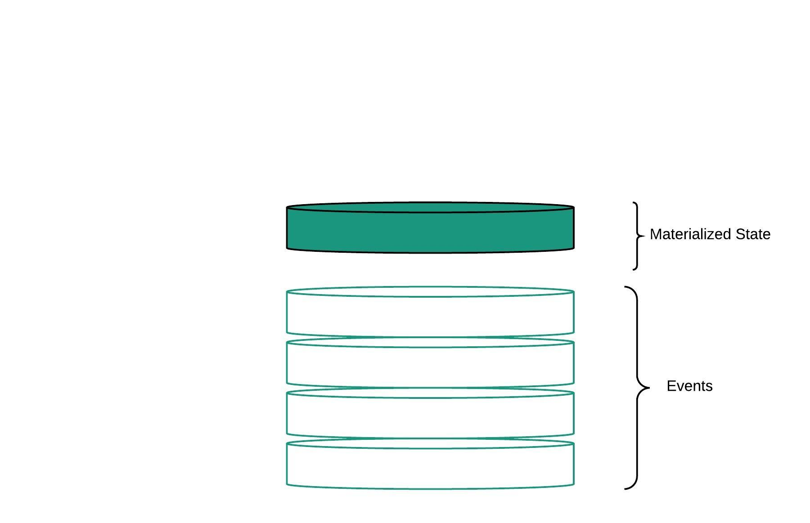
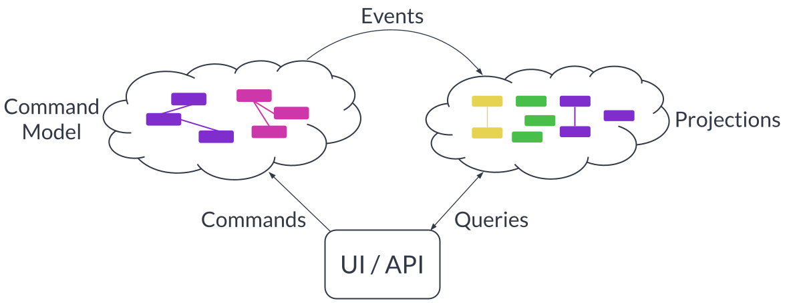

# Event Sourcing

In a traditional way of storing an application’s state, we capture the current state and store it in some relational or [NoSQL](https://en.wikipedia.org/wiki/NoSQL) database. While this approach is really straightforward, it does not provide a way of deducing how we got to that current state. Of course, one may argue that we can have a separate model for keeping the history of actions that lead to the current state, but besides the additional complexity, these two models could easily go different paths and start being inconsistent

Event Sourcing is a way of storing an application’s state through the history of events that have happened in the past. The current state is reconstructed based on the full history of events, where each event represents a change or fact in our application. Events give us a single source of truth about what happened in our application. It is especially beneficial in applications that need to provide a full audit log to external reviewers. The current state is called _Materialized state_ in some resources \(see _Figure 1_\).

Let's see on an example how Event Sourcing differs from Traditional Storage \(see Figure 2\). In Traditional Storage system we only know that we have ordered a pizza and a cola. In Event Sourcing, we see that a user selected a pizza, selected a cola, selected an ice cream and deselected an ice cream. Information about selection/deselection of an ice cream is not present in Traditional Storage. With Event Sourcing we can reason about why a user deselected an ice cream, was the price too high, or some other reason. The point is that we didn't lose that information and we can benefit from it in various ways. Later on we can see that a user confirmed the order.

## Event Store

Event Sourcing require an Event Store to store events. Since events are not to be modified \(an event is a fact that something happened and facts cannot be modified\), an Event Store should be optimized for appends. Event ordering plays a really important role in event-sourced systems - as many times as we are reconstructing our materialized state, we want to arrive at the same result.

[Axon Server ](../axon-server-introduction.md)is the default choice within Axon and it offers an _**enterprise grade**_ _**purpose-built event store**_ which is highly optimized for storing/retrieving events. The Server is available as a Standard Edition or an Enterprise Edition.

Alternatively, the Axon Framework provides support for an RDBMS or a NoSQL database as an Event Store.

## Event Sourcing and CQRS

Event Sourcing is a natural fit with [CQRS](https://axoniq.io/resources/cqrs). 
Typically, the command model in a CQRS based architecture is not stored, other than by its sequence of events. 
The query model is continuously updated to contain a certain representation of the current state, based on these same events.

Instead of reconstructing the entire command model state, which would be a lengthy process, we separate the model in aggregates; parts of the model that need to be strongly consistent. 
This separation in aggregates makes models easier to reason about, more adaptable to change, and more importantly, it makes applications more scalable.

## Benefits

A summary of the benefits of Event Sourcing are listed below

_Naturalized Audit Trail_

In order to comply with certain regulations, it is required from a software system to provide a full audit log. Event-sourced systems give us exactly that, full audit log and we don’t have to provide any additional information to the reviewer. One additional report that is built up from the event stream and we’re ready to go.

_Analytics_

The full history of interactions with our application is stored in the Event Store. We could apply various machine learning algorithms to extract information from these interactions that matter to our business.

_Design Flexibility_

Agile approach to building software systems requires that we should be able to adapt to any change coming along the way. Ability to replay the event stream from the beginning of time with new business logic means that we don’t have to worry about decisions we make \(apart from which events are important to be stored\), we can always fix the behaviour later. Introducing new views to our event stream means adding a new component with event listeners to the solution.

_Temporal Reports_

We all know how difficult it is to investigate an incident that happened in production. It requires a lot of logs digging and reasoning about the state that the system was at that point in time. Event sourcing gives us a way to replay events to a certain point in time and debug the application in a state in which the incident occurred. We don’t have to worry about whether we put the correct log level or whether we logged all necessary paths to figure the incident out.

## Conclusion

In software systems where our business can benefit from the history of events that had happened Event Sourcing comes as a natural solution. One of the key benefits of Event Sourcing is evolvability of software systems - when we discover a new reporting component that needs to be added, we can just write it up, replay historic events to it and have it running. This is highly beneficial in blue-green deployments when zero downtime is enforced.

Integration with external systems can be done using events. In such scenarios, events are our API and external system must understand them. Of course, we might not publish all events to the integration event hub, only ones that are _publicly important_.

_\* If we are applying CQRS \(Command Query Responsibility Segregation\) practices, we could rebuild our command model and query model as well_

[Axon Server](../axon-server-introduction.md) provides an easy way to start up and scale event-sourced Java applications.

